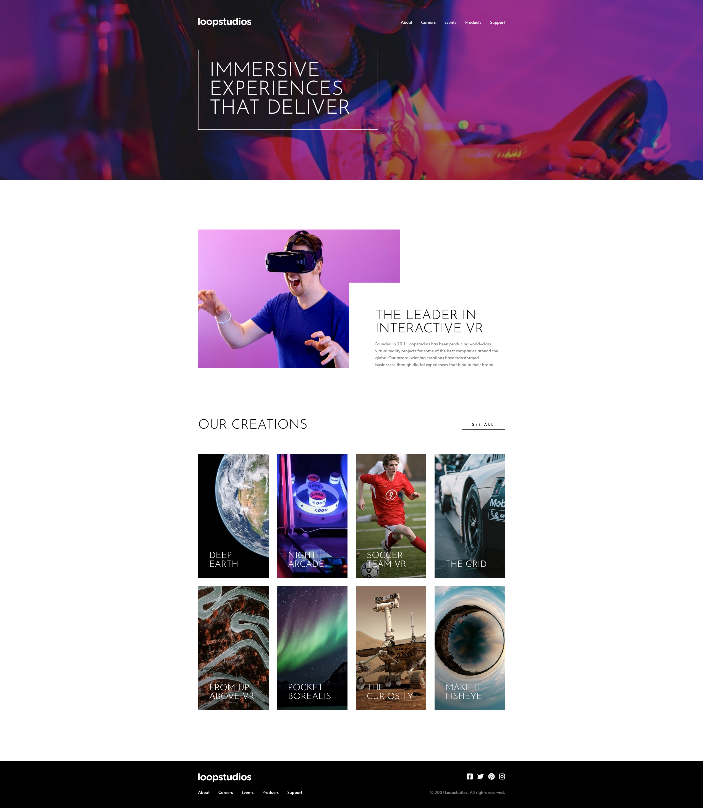

# Frontend Mentor - Loopstudios landing page solution

This is a solution to the [Loopstudios landing page challenge on Frontend Mentor](https://www.frontendmentor.io/challenges/loopstudios-landing-page-N88J5Onjw). Frontend Mentor challenges help you improve your coding skills by building realistic projects.

## Table of contents

- [The challenge](#the-challenge)
- [Screenshot](#screenshot)
- [Links](#links)
- [Built with](#built-with)
- [Author](#author)

### The challenge

Users should be able to:

- View the optimal layout for the site depending on their device's screen size
- See hover states for all interactive elements on the page

### Screenshot

### Links

- Solution URL: [https://github.com/awongdev/loopstudios](https://github.com/awongdev/loopstudios)
- Live Site URL: [https://awongdev.github.io/loopstudios/](https://awongdev.github.io/loopstudios/)

### Built with

- Semantic HTML5 markup
- CSS custom properties
- Flexbox
- CSS Grid
- Mobile-first workflow
- [Sass](https://sass-lang.com/) - CSS preprocessor

## Author

- GitHub - [awongdev](https://github.com/awongdev)
- Frontend Mentor - [@AceDub](https://www.frontendmentor.io/profile/AceDub)
